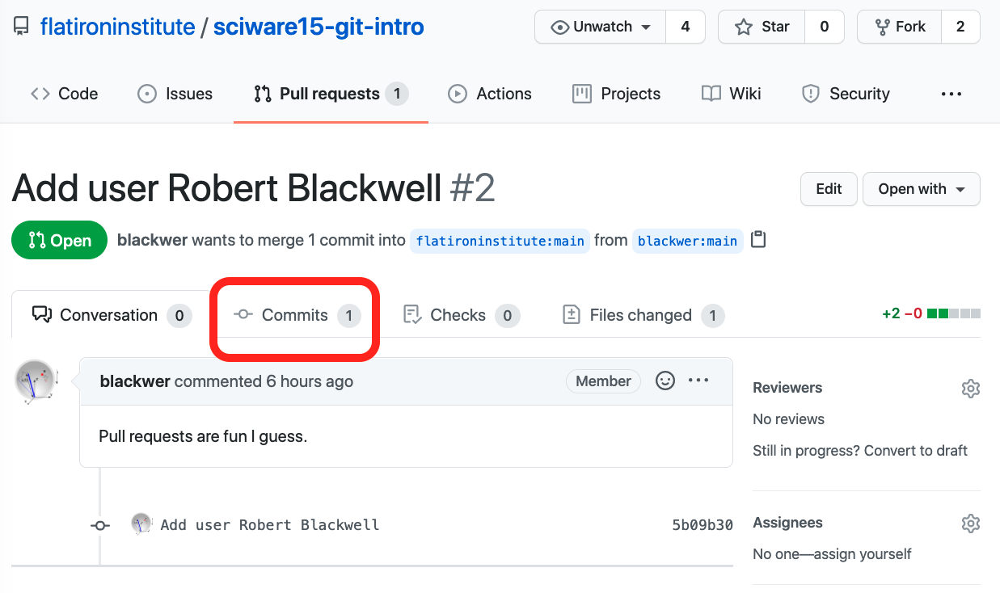
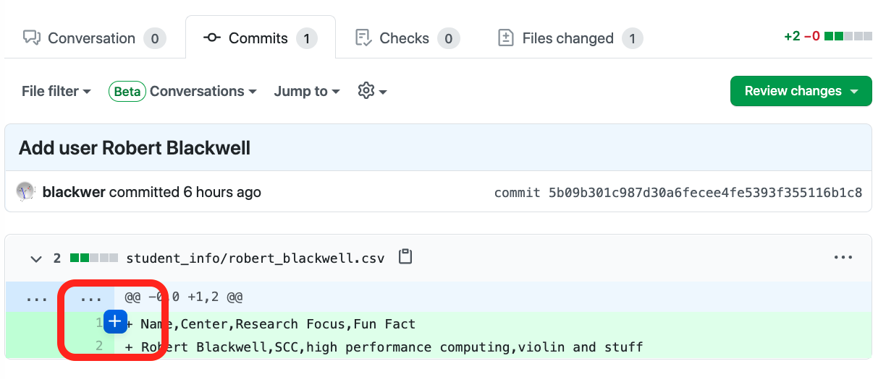

# Sciware

## Intro to Github

https://github.com/flatironinstitute/learn-sciware-dev/tree/master/15_IntroGithub

## Rules of Engagement

### Goal:

Activities where participants all actively work to foster an environment which encourages participation across experience levels, coding language fluency, *technology choices*\*, and scientific disciplines.

<small>\*though sometimes we try to expand your options</small>

## Rules of Engagement

- Avoid discussions between a few people on a narrow topic
- Provide time for people who haven't spoken to speak/ask questions
- Provide time for experts to share wisdom and discuss
- Work together to make discussions accessible to novices

<small>
(These will always be a work in progress and will be updated, clarified, or expanded as needed.)
</small>

## Zoom Specific

- If comfortable, please keep video on so we can all see each other's faces.
- Ok to break in for quick, clarifying questions.
- Use Raise Hand feature for new topics or for more in-depth questions.
- Please stay muted if not speaking. (Host may mute you.)
- We are recording. Link will be posted on #sciware Slack.

## Future Sessions

- July 8: Intro to IDEs and Debugging
- Suggest topics and vote on options in #sciware Slack

## Why do we Need Forks?

- When we want to make changes _separately_ from a main project
- We want to take an existing project in a _new_ direction
- Sometimes we want to make and track changes to repositories we don't have permissions to push to

## What's a Fork?

## Forking Workflow

1. Fork and clone the project
2. Add the code and push to your fork
3. Open a pull request
4. Pull everyone else's changes

  

- Then we'll demonstrate reviewing a pull request

## Step 1: Fork and Clone

## Step 1: Fork and Clone

    First we need to fork the repo
    

    Next, we clone <em>our</em> fork of the repo:
    <pre  style="font-size:0.75em;">
        <code data-trim data-noescape class="language-zsh">
        ➜ git clone https://github.com/your_user_name/sciware15-git-intro.git
        </code>
    </pre>

## Step 1: Add an Upstream

 If you already have a copy of this repo from yesterday's workshop, that's ok, keep it!
<pre  style="font-size:0.75em;">
    <code data-trim data-noescape class="language-zsh" data-line-numbers="1,4,5,11">
    ➜ git remote -v
    origin  git@github.com:flatironinstitute/sciware15-git-intro.git (fetch)
    origin  git@github.com:flatironinstitute/sciware15-git-intro.git (push)
    ➜ git remote rename origin upstream
    ➜ git remote add origin git@github.com:jamesETsmith/sciware15-git-intro.git
    ➜ git remote -v
    origin  git@github.com:jamesETsmith/sciware15-git-intro.git (fetch)
    origin  git@github.com:jamesETsmith/sciware15-git-intro.git (push)
    upstream  git@github.com:flatironinstitute/sciware15-git-intro.git (fetch)
    upstream  git@github.com:flatironinstitute/sciware15-git-intro.git (push)
    ➜ git pull upstream main
    </code>
</pre>

## Step 2a: Add Your Code 

Add a file in `student_info` called `firstName_lastName.csv` with the following info:

- Your full name
- Your enter
- Your research focus

## Step 2a: Add Your Code

Mine looks like this:

<pre  style="font-size:0.75em;">
    <code data-trim data-noescape class="language-plaintext">
Name,Center,Research Focus, Fun Fact
James Smith, CCQ, Quantum Chemistry, My initials are JETS
    </code>
</pre>

## Step 2b: Push to Your Fork

## Step 2b: Push to Your Fork

- Run `git add` on your file
- Commit it
- Push to your fork

Mine looks like this:

<pre  style="font-size:0.75em;">
    <code data-trim data-noescape class="language-zsh">
➜ git status
...
➜ git add student_info/james_smith.csv
➜ git commit -m "Adding info for James Smith"
...
➜ git push origin main
    </code>
</pre>

## Step 3: Open a Pull Request

## Step 3: Open a Pull Request

- Using your browser, navigate to your forked repository
- It should look something like this:

- Click on the `Contribute` button

## Step 3: Open a Pull Request

- Click on the `Open pull request` button

## Step 3: Open a Pull Request

## Step 3: Open a Pull Request

Things to think about when making pull requests (PR):

<ul>
<li>Many projects have PR templates with information you need to fill out, <b><em>use them</em></b>!</li>
<li class="fragment">Include <b><em>why</em></b> you're making the PR, what steps you took, and how it addresses a current problem.</li>
<li class="fragment">Bug reports should <b><em>always</em></b> include a minimum working example.</li>
<li class="fragment">PRs (and Issues) are a valuable <b><em>public</em></b> record, just like StackOverflow.</li>
</ul>

## Step 4: Pull Other's Changes

## Step 4: Pull Other's Changes

If the original repo from `flatironinstitute` isn't your upstream, set it now and then pull from it.

<pre  style="font-size:0.75em;">
    <code data-trim data-noescape class="language-zsh" data-line-numbers="1,4,5,10">
    ➜ git remote -v
    origin  git@github.com:flatironinstitute/sciware15-git-intro.git (fetch)
    origin  git@github.com:flatironinstitute/sciware15-git-intro.git (push)
    ➜ git remote rename origin upstream
    ➜ git remote add origin git@github.com:jamesETsmith/sciware15-git-intro.git
    ➜ git remote -v
    origin  git@github.com:jamesETsmith/sciware15-git-intro.git (fetch)
    origin  git@github.com:jamesETsmith/sciware15-git-intro.git (push)
    upstream  git@github.com:flatironinstitute/sciware15-git-intro.git (fetch)
    upstream  git@github.com:flatironinstitute/sciware15-git-intro.git (push)
    ➜ git pull upstream main
    </code>
</pre>

# Survey

## http://bit.ly/sciware-github2-2021

## Reviewing a Pull Request

As other students make PRs, go to the pull requests tab on GitHub.

## Reviewing a Pull Request

Choose another student's PR and click on it.

## Reviewing a Pull Request

Click on the commit to see the diff of their changes and hover over a line until you see the `+` sybmol.

## PR Case Study

Here's an example of a PR _without_ a helpful description:

## PR Case Study

Here's an example of a [PR](https://github.com/scikit-learn/scikit-learn/pull/20251) _with_ a helpful description:

## Extra Resources

Check out and bookmark these tutorials for more information about git and the forking workflow:

- [Bitbucket: Making a Pull Request](https://www.atlassian.com/git/tutorials/making-a-pull-request)
- [CodeRefinery: Distributed version control and forking workflow](https://coderefinery.github.io/git-collaborative/03-distributed/)

# Survey

## http://bit.ly/sciware-github2-2021
