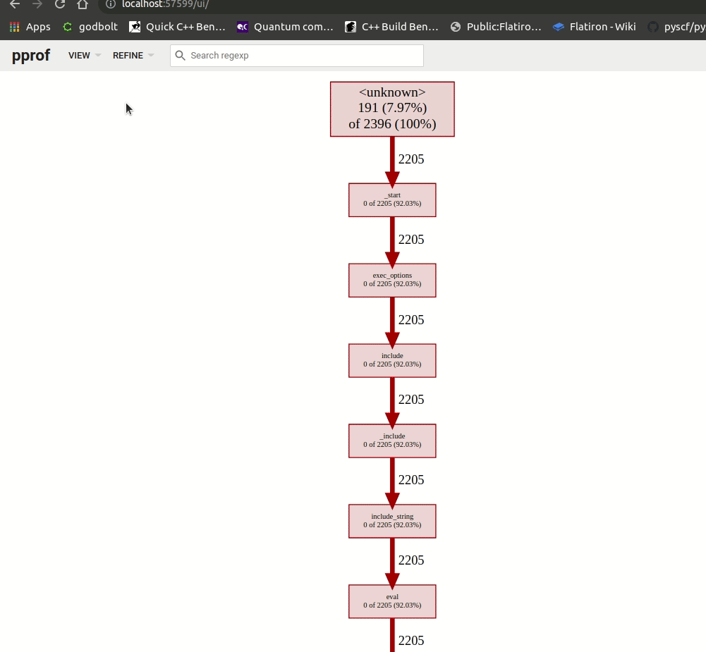
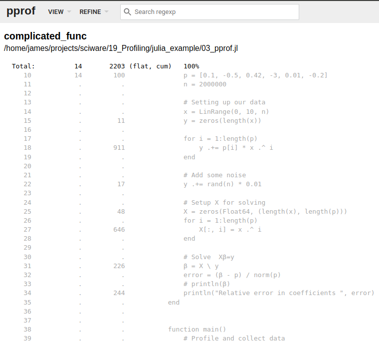

# Sciware

## Finding Where Your Code Spends Time
### Performance Troubleshooting and Profiling

https://github.com/flatironinstitute/sciware/tree/main/19_Profiling


## Rules of Engagement

### Goal:

Activities where participants all actively work to foster an environment which encourages participation across experience levels, coding language fluency, *technology choices*\*, and scientific disciplines.

<small>\*though sometimes we try to expand your options</small>


## Rules of Engagement

- Avoid discussions between a few people on a narrow topic
- Provide time for people who haven't spoken to speak/ask questions
- Provide time for experts to share wisdom and discuss
- Work together to make discussions accessible to novices

<small>
(These will always be a work in progress and will be updated, clarified, or expanded as needed.)
</small>


## Zoom Specific

- If comfortable, please keep video on so we can all see each other's faces.
- OK to break in for quick, clarifying questions.
- Use Raise Hand feature for new topics or for more in-depth questions.
- Please stay muted if not speaking. (Host may mute you.)
- We are recording. Link will be posted on #sciware Slack.
- Please keep questions for the speaker in the Zoom chat.


## Future Sessions

- Suggest topics and vote on options in #sciware Slack


## Today's agenda

- Intro
- Time
- Python
- Julia
- C


# Profiling Intro

### Dylan Simon


## Goal

- We always want everything to take less time
- Need a way to quantify "less". And measure "time".
- It's easy to figure out how much time something takes... right?


## "Wall time"

- Useful baseline measure
- Can compare changes (algorithms, dependencies, architectures, anything...)
- Which parts take time?
- What if it takes weeks? (Or milliseconds?)
- Wall time is a noisy measure (system, scheduling, filesystem, network overhead)


## Profilers

- Tools to break down which parts of your code take time
   - Program: entire run of executable
   - Function: time how long each function takes, how many times
   - Line of code
   - Machine instruction
- Each of these might run multiple times
   - total time, number of executions, average time/execution


## Strategies

- Is this what I expected?
   - Is this part running too many times?
   - Do the counts make sense (think about loops, sanity check)?
   - Are unexpected parts slow?
- Can this be faster?
- Is this necessary?
- Calculation *has* to take time...


## Bite-sized pieces

- Break calculations into smaller pieces
   - Smaller data sets, fewer iterations
- Profiling doesn't require getting results, just running code
- Can use smaller profiling results to infer longer run times (multiply!)
- Heisenberg: code when observed... runs slower


## Time units

- "Wall time" = time
- "CPU time" = cpu cores * time
   - Multiple threads
   - 1 core for 1 second + 8 cores for 5 seconds + 1 core for 2 seconds = 43 cpu seconds, 8 wall seconds
   - "CPU hours": cluster usage (allocated, may be idle), 130k cores = 1.1B cpu hours/year


# Simple timing

### Lehman Garrison


# Python profiling

### Robert Blackwell


# Julia profiling

<h3 style="color:#7e588aff">James Smith (CCQ)</h3>


# Examples

- All examples are in `sciware/19_profiling/julia_example`
- To following along you'll need Julia and the following Julia packages:
  - `PProf`
  - `CSV`
  - `DataFrames`
- You can install them by running `install_prereqs.jl`


# Using `@time` Pt. 1

- Array/Matrix/Tensor memory access matters
<div style="display: table; clear:both; width:100%;">
   <div style="float:left; width:50%">
      <pre  style="font-size:0.6em; width:100%">
    <code data-trim data-noescape data-line-numbers="1,5" class="language-julia">
function copy_cols(x::Vector{Float64})
    n = size(x, 1)
    out = zeros(Float64, n, n)
    for i = 1:n
        out[:, i] = x
    end
    out
end
    </code>
    </pre>
   </div>
   <div style="float:left; width:50%">
     <pre  style="font-size:0.6em; width:100%">
      <code data-trim data-noescape data-line-numbers="1,5" class="language-julia">
function copy_rows(x::Vector{Float64})
    n = size(x, 1)
    out = zeros(Float64, n, n)
    for i = 1:n
        out[i, :] = x
    end
    out
end
      </code>
    </pre>
   </div>
</div>


# Using `@time` Pt. 2
- To run the comparison, we can do the following:
```julia
function main()
    N = Int(1e4)
    x = randn(N)

    println("Copying vector to columns")
    @time copy_cols(x)
    println("Copying vector to rows")
    @time copy_rows(x)
end
```


# Using `@time` Pt. 3
```zsh
➜  julia 01_timer.jl 
Copying vector to columns
  0.354818 seconds (2 allocations: 762.939 MiB, 1.12% gc time)
Copying vector to rows
  1.033734 seconds (2 allocations: 762.939 MiB, 3.08% gc time)
```


# Using `@profile` Pt. 1
<div style="display: table; clear:both; width:100%;">
   <div style="float:left; width:50%">
      <pre  style="font-size:0.6em; width:100%">
    <code data-trim data-noescape  class="language-julia">
function add_no_prealloc(x::Vector{Float64})
    x_new = x .+ 3.0
    return x_new
end
    </code>
    </pre>
   </div>
   <div style="float:left; width:50%">
     <pre  style="font-size:0.6em; width:100%">
      <code data-trim data-noescape  class="language-julia">
function add_prealloc!(x::Vector{Float64})
    x .+= 3.0
    nothing
end
      </code>
    </pre>
   </div>
</div>


# Using `@profile` Pt. 2
- To run the comparison, we can do the following:
  
```julia
function main()
    x = zeros(10)

    println("\nShowing the profiling info")
    Profile.clear()
    @profile (
        for i = 1:1e7
            add_no_prealloc(x)
            add_prealloc!(x)
        end
    )
    Profile.print(format = :tree, maxdepth = 12)

end
```


# Using `@profile` Pt. 3
<pre style="font-size:0.4em"><code data-trim data-noescape  class="language-zsh" data-line-numbers="13,17-19,21,22">
Showing the profiling info
Overhead ╎ [+additional indent] Count File:Line; Function
=========================================================
   ╎398 @Base/client.jl:495; _start()
   ╎ 398 @Base/client.jl:292; exec_options(opts::Base.JLOptions)
   ╎  398 @Base/Base.jl:418; include(mod::Module, _path::String)
   ╎   398 @Base/loading.jl:1253; _include(mapexpr::Function, mod::Module, _path::String)
   ╎    398 @Base/loading.jl:1196; include_string(mapexpr::typeof(identity), mod::Module, code::String, filename::String)
   ╎     398 @Base/boot.jl:373; eval
 12╎    ╎ 12  ...ojects/sciware/19_Profiling/julia_example/02_profiling.jl:5; add_no_prealloc(x::Vector{Float64})
  4╎    ╎ 4   ...ojects/sciware/19_Profiling/julia_example/02_profiling.jl:7; add_no_prealloc(x::Vector{Float64})
  1╎    ╎ 1   ...ojects/sciware/19_Profiling/julia_example/02_profiling.jl:10; add_prealloc!(x::Vector{Float64})
   ╎    ╎ 381 ...ojects/sciware/19_Profiling/julia_example/02_profiling.jl:38; main()
   ╎    ╎  381 ...k-src/usr/share/julia/stdlib/v1.7/Profile/src/Profile.jl:28; macro expansion
  7╎    ╎   332 ...jects/sciware/19_Profiling/julia_example/02_profiling.jl:40; macro expansion
  3╎    ╎    3   @Base/simdloop.jl:0; add_no_prealloc(x::Vector{Float64})
 10╎    ╎    10  ...jects/sciware/19_Profiling/julia_example/02_profiling.jl:5; add_no_prealloc(x::Vector{Float64})
   ╎    ╎    311 ...jects/sciware/19_Profiling/julia_example/02_profiling.jl:6; add_no_prealloc(x::Vector{Float64})
  1╎    ╎    1   ...jects/sciware/19_Profiling/julia_example/02_profiling.jl:7; add_no_prealloc(x::Vector{Float64})
  2╎    ╎   49  ...jects/sciware/19_Profiling/julia_example/02_profiling.jl:41; macro expansion
   ╎    ╎    41  ...ects/sciware/19_Profiling/julia_example/02_profiling.jl:11; add_prealloc!(x::Vector{Float64})
  6╎    ╎    6   ...ects/sciware/19_Profiling/julia_example/02_profiling.jl:12; add_prealloc!(x::Vector{Float64})
Total snapshots: 800
</code></pre>


# Using `PProf` Pt. 1
- Now let's look at a more complicated function

```julia
function analyze_data()
    # Read in data
    df = CSV.read("data/noisy_data.csv", DataFrame; types = [Float64, Float64])

    # Shorthands
    x = Vector{Float64}(df[!, "X"])
    y = Vector{Float64}(df[!, "Y"])

    # Setup X for solving
    X = zeros(Float64, (length(x), 2))
    X[:, 1] = sin.(x)
    X[:, 2] = x .^ 2

    # Solve  Xβ=y
    β = X \ y
    println(β)
end
```


# Using `PProf` Pt. 2
- Use `@profile` to collect information about our the function of interest (`analyze_data()`)
- Save to a file `_03_profile_data.jlprof`
 
```julia
function main()

    Profile.clear()
    @profile analyze_data()
    Profile.print(format = :tree, maxdepth = 9)

    save("_03_profile_data.jlprof", Profile.retrieve()...)

end
```


# Using `PProf` Pt. 3
- Open the Julia REPL (like a shell)
- Load the data
- Using `pprof()` to analyze the profiling data

```julia
julia> using PProf, FlameGraphs, FileIO
julia> data = load("_03_profile_data.jlprof")
julia> g = flamegraph(data[1]; lidict=data[2])
julia> pprof(g)
```


# Using `PProf` Pt. 3
- Open the `PProf` interface in a browser (something like: http://localhost:57599)



# Using `PProf` Pt. 4
- Now we can examine the lines one-by-one!




# Julia Wrap-Up

- Check out the examples in the [sciware repo](https://github.com/flatironinstitute/sciware/tree/main/19_Profiling/julia_example) for even more details!


# C profiling

## with gprof

### Dylan Simon


## Building

- Compile and link all files with `-g -pg`
- Better to disable optimization (no `-O`)
- Works with `gcc`, `g++`, `gfortran`, `clang`, `clang++`


## Running

- Run your program normally to produce `gmon.out` (must not be killed/crash)
- `GMON_OUT_PREFIX=foo ./myprog` produces `foo.PID`
- Analyze with: `gprof myprog gmon.out`

[*Example*](gprof_example)


## Alternatives

- oprofile (full system)
- vtune (processor stats)
- ...
- what do you use?


# Questions


# Survey

